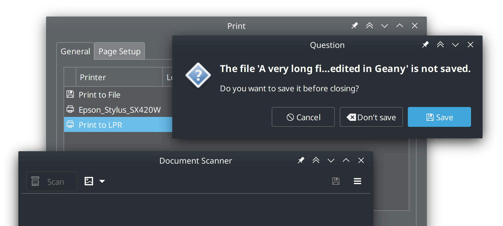

# gtk3-classic

This repository contains patches to restore GTK 3's look & feel reminiscent to
earlier versions. With many enhancements such as disabled CSD headers (on X11),
traditional dialog boxes and file browser improvements.

These are designed to work on non-GNOME desktops (such as XFCE and MATE)
and any other environment where GTK applications are used. Running
on GNOME desktops is not recommended!

[Patch List](README.Patches.md) |
[Environment Variables](README.Variables.md) |
[Screenshots](https://github.com/lah7/gtk3-classic/wiki/Screenshots) |
[Wiki](https://github.com/lah7/gtk3-classic/wiki)

## About

Once known as `gtk3-mushrooms`, this repository is a collection of patches
that apply on top of the GTK 3 source code. It's not a fork of GTK 3.

This repository acts as a central hub for these patches and will keep rolling
if there's a new GTK 3 release. The patches aim to bring a bit of reminiscence
to GTK 2 and GTK 3's early days (hence, "classic").
[See below on contributing patches.](#contributing)

**This repository is provided as-is, with no warranty or guaranteed support.**
While the patched installation should just work, you are entering unsupported territory.

## Patches

See these files:

* [README.Patches.md](README.Patches.md) — a complete list of what patches do.
* [README.Variables.md](README.Variables.md) — a summary
of the available environment variables.

Some patches are optional behind environment variables or an additional step
[(like enabling alternating colour rows)](https://github.com/lah7/gtk3-classic/wiki/Treeview:-Alternating-Colours-CSS)

For best results, [try downgrading](https://github.com/lah7/gtk3-classic/wiki/Downgraded-GNOME-GTK-applications)
and pinning older versions of GTK 3 applications.

## Download

* [Arch Linux](#arch-linux)
* [Gentoo](#gentoo)
* [Ubuntu (LTS)](#ubuntu) (discontinued)

See [#111](https://github.com/lah7/gtk3-classic/issues/111) for details about
Debian builds based on these patches.

### Arch Linux

Available from the AUR under [`gtk3-classic`](https://aur.archlinux.org/packages/gtk3-classic/) (previously `gtk3-mushrooms`).

Based on the official [`gtk3`](https://archlinux.org/packages/extra/x86_64/gtk3/) package
with some changes to make the package more lightweight:

* Demos, examples and tests excluded.
* Some dependencies made optional:
    * `adwaita-icon-theme` - default icon theme
    * `cantarell-fonts` - default font
    * `dconf` - default GSettings backend
    * `colord` - color management support
    * `libcups` - enable printers in print dialog

There's a few ways to install:

* The [release notes](https://github.com/lah7/gtk3-classic/releases/latest) contains a package
built autonomously by [GitHub Actions](https://github.com/lah7/gtk3-classic/actions?query=branch%3Amaster) for your convenience.

      sudo pacman -U ./*.tar.zst

* Use an [AUR helper](https://wiki.archlinux.org/title/AUR_helpers), such as `yay`:

      yay -S gtk3-classic

    > The [AUR's PKGBUILD](https://aur.archlinux.org/cgit/aur.git/tree/PKGBUILD?h=gtk3-classic) follows this repository's [latest release](https://github.com/lah7/gtk3-classic/releases) as its source.

* Build from source:

      git clone https://github.com/lah7/gtk3-classic
      cd gtk3-classic
      makepkg -s

    To exclude patches, comment (`#`) them out in the `series` file.

### Ubuntu

> [!WARNING]
> Ubuntu packages for gtk3-classic has been discontinued.
> The existing PPA will continue to work, but no new packages will be created.
> **Use at your own risk.**
>
> [You may build them yourself](https://github.com/lah7/gtk3-classic/wiki/Ubuntu-Packaging) or contribute improvements to reliably build locally via our [create-ubuntu-package.sh](scripts/create-ubuntu-package.sh) script.

> [!NOTE]
> **Only available for LTS releases:** 20.04, 22.04, 24.04

These packages are based on the original [`gtk+3.0`](https://packages.ubuntu.com/search?section=all&arch=any&keywords=gtk%2B3.0&searchon=sourcenames)
package, with the version suffixed with `~classic`. These packages are rarely
updated, as they are patched against the GTK 3 version originally used for that release.

To install, [add the repository](https://launchpad.net/~lah7/+archive/ubuntu/gtk3-classic) and upgrade your packages:

    sudo add-apt-repository ppa:lah7/gtk3-classic
    sudo apt dist-upgrade

To restore the original GTK 3, use `ppa-purge` to restore the packages from Ubuntu's repository:

    sudo apt-get install ppa-purge
    sudo ppa-purge ppa:lah7/gtk3-classic

This works for stock Ubuntu. If you're using an Ubuntu derivative (like Linux Mint), you may need to
[manually downgrade packages](https://github.com/lah7/gtk3-classic/issues/116#issuecomment-2439990293) instead.

## Gentoo

A Gentoo ebuild is available as `x11-libs/gtk3-classic-patches` in
the `khoverlay` overlay.  Rather than providing a patched `x11-libs/gtk+:3`
ebuild directly, this ebuild installs user patches which will be applied on
subsequent builds of GTK 3.  This way, the latest official Gentoo GTK 3 ebuild can
always be used.

To install, first add the overlay and accept the package's testing status:

    sudo eselect repository enable khoverlay
    sudo emerge --sync khoverlay
    echo 'x11-libs/gtk3-classic-patches::khoverlay' | sudo tee -a /etc/portage/package.accept_keywords

Then install the patches and rebuild GTK 3:

    sudo emerge -av gtk3-classic-patches
    sudo emerge -av1 gtk+:3

To revert to standard GTK 3, remove the patches and rebuild GTK 3:

    sudo emerge -cav gtk3-classic-patches
    sudo emerge -av1 gtk+:3

## Problems?

These patches are for your own pleasure. They are **not supported by GTK developers,
your distribution or application developers**. Please don't send bug reports to
them because of this patched GTK 3 installation.

If you are having trouble with an application or theme, try:

* Run the application from the terminal with `GTK_CSD=0` before the command.
* Revert to the original `gtk3` to confirm these patches caused the problem.

If a patch is at fault, Arch and Gentoo users for instance can comment out (`#`)
patches in `series` until they find the one causing it.

Arch users can use the included [`scripts/test-exclude-each-patch.sh`] script.
It'll exclude one patch at a time and create builds using the `PKGBUILD` in this repository.

[`scripts/test-exclude-each-patch.sh`]: https://github.com/lah7/gtk3-classic/blob/master/scripts/test-exclude-each-patch.sh

## Contributing

We're not writing new patches — only maintaining what we've got.

You are welcome to open a pull request with a new patch [or fix](https://github.com/lah7/gtk3-classic/issues?q=is%3Aissue+is%3Aopen+label%3A%22help+wanted%22) if:

* It does not break GTK 3 or any GTK applications.
* Offers "classic" functionality remensiant of GTK 2 or early versions of GTK 3.
* Optional behind an environment variable if it introduces a significant change.

Patches are added [using the `quilt` system.](https://github.com/lah7/gtk3-classic/wiki/Creating-and-Managing-Patches)

Our primary packaging and testing happens on Arch. Checksums in `PKGBUILD`
need to be updated to pass the automated checks. On an Arch system, these can be
regenerated automatically:

    updpkgsums

(Provided in `pacman-contrib`)

If you're not using Arch Linux, don't worry! When you create the pull request
and automated checks run, it'll fail ❌ and present a patch of required changes.

## Community

The [Discussions](https://github.com/lah7/gtk3-classic/discussions) tab
is where you can find curated tips, chat, support and introductions from other users.

Here are some complementary projects and themes for your classic experience:

- [Human theme](https://github.com/luigifab/human-theme)
  - Plus, [@luigifab's gist with additional GTK 3 and GTK 4 patches](https://gist.github.com/luigifab/0fce786cdb93b5687069a82f490ea95e)
- [Raleigh theme & icons](https://github.com/thesquash/gtk-theme-raleigh)
- [Bluecurve theme & icons](https://www.gnome-look.org/p/2191581)
- [Ambiant-MATE theme & icons](https://github.com/lah7/Ambiant-MATE)
- [@thesquash's gtk3-classic-module](https://github.com/thesquash/gtk3-classic-module) _(featuring many of these patches without needing to recompile GTK 3)_
- XFCE users might be interested in [this additional patch for the file chooser.](https://patch-diff.githubusercontent.com/raw/lah7/gtk3-classic/pull/94.patch)
  - Avaliable from the AUR as [`gtk3-classic-xfce`](https://aur.archlinux.org/packages/gtk3-classic-xfce)

## License

Patches follow the same license as [GTK 3](https://gitlab.gnome.org/GNOME/gtk/-/commits/gtk-3-24), which is [LGPLv2](https://gitlab.gnome.org/GNOME/gtk/-/blob/main/COPYING?ref_type=heads).
